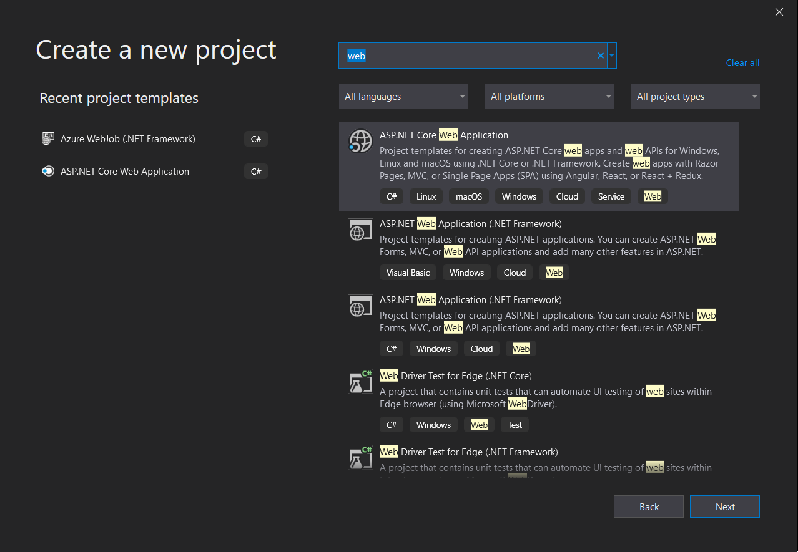
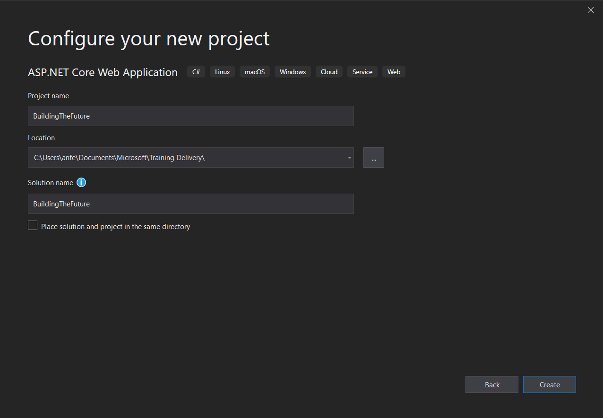
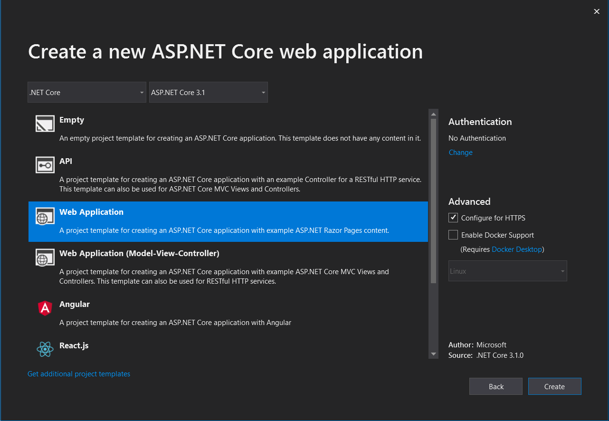
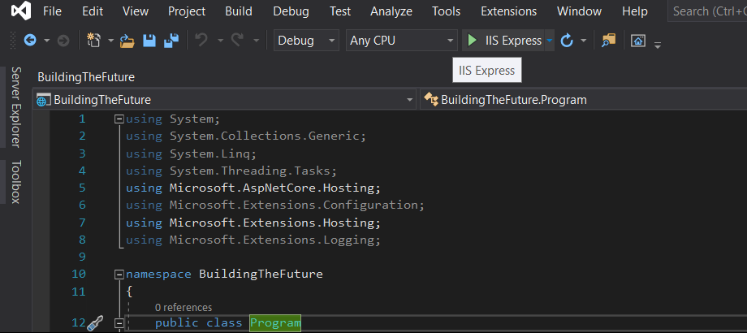
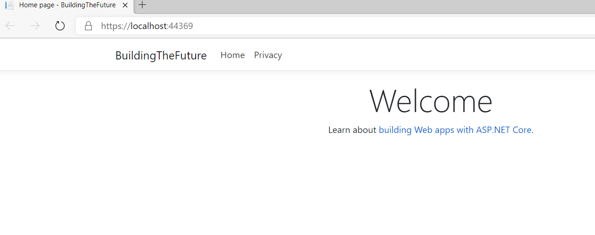

# Create a .NET Core web application running locally

1. Create a New project in Visual Studio 2019 or download the application files [at link](https://github.com/andreatmicro/BuildingTheFuture/tree/master/1.%20.Net%20Core%20app%20running%20locally/BuildingTheFuture)

2. Configure your new project's name and Location:

3. Create a new ASP.NET Core web application:

4. Run application locally:

4. Verify application running on localhost:

Next hands on Lab:
[Migration to Azure App Service](https://github.com/andreatmicro/BuildingTheFuture/tree/master/2.%20Migration%20to%20Azure%20App%20Service)
