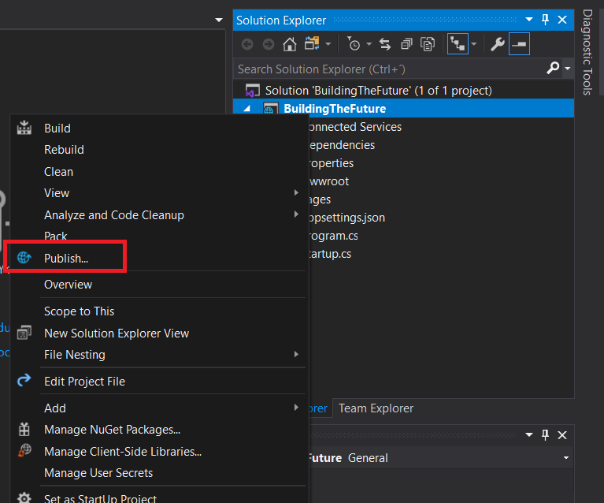
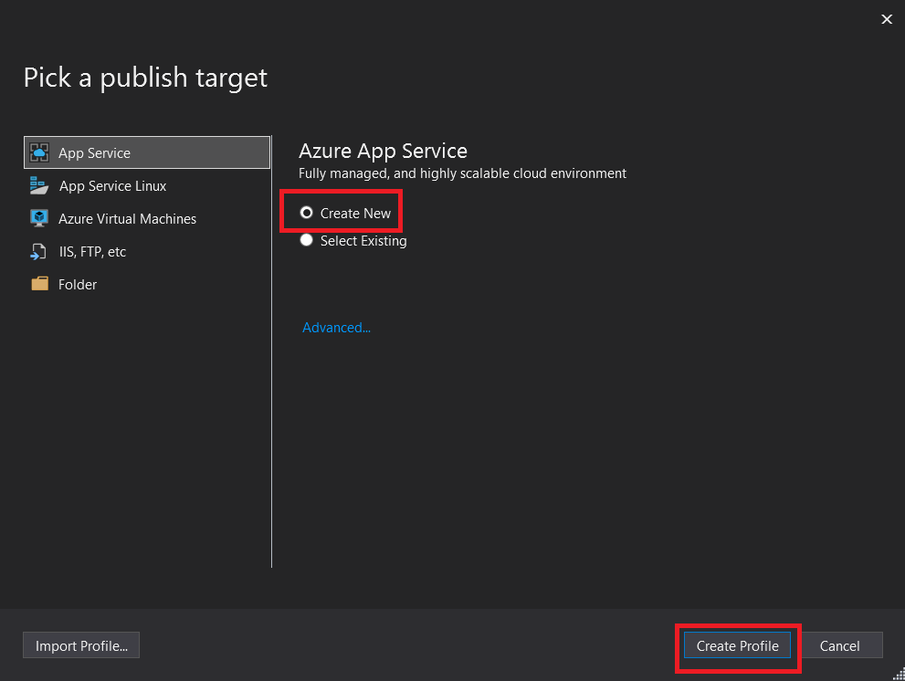
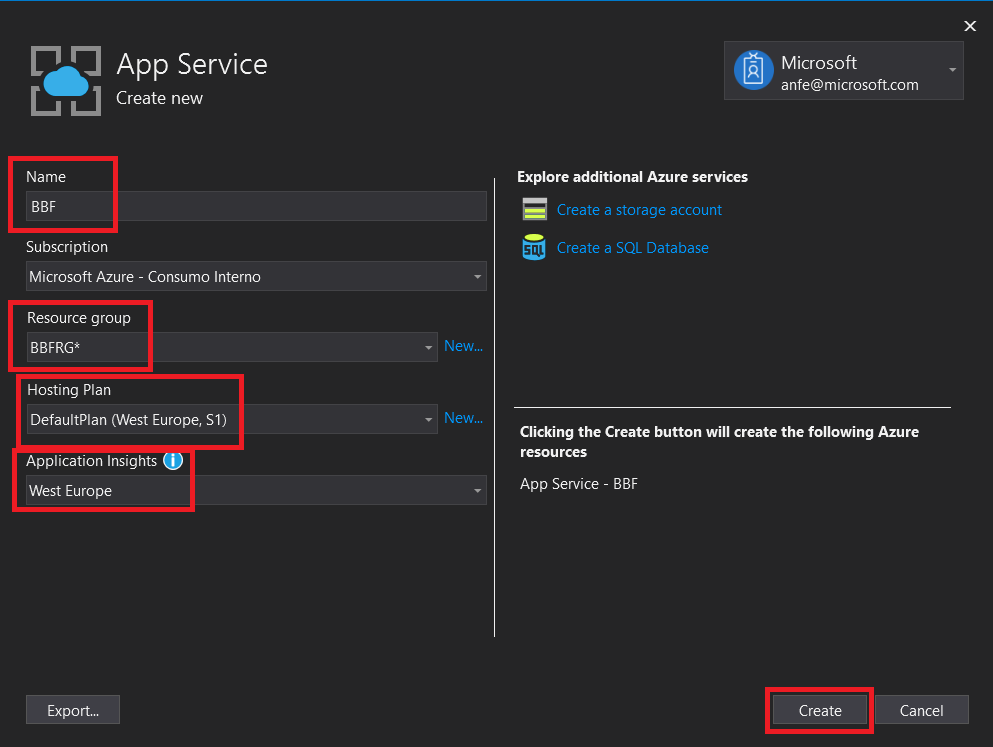
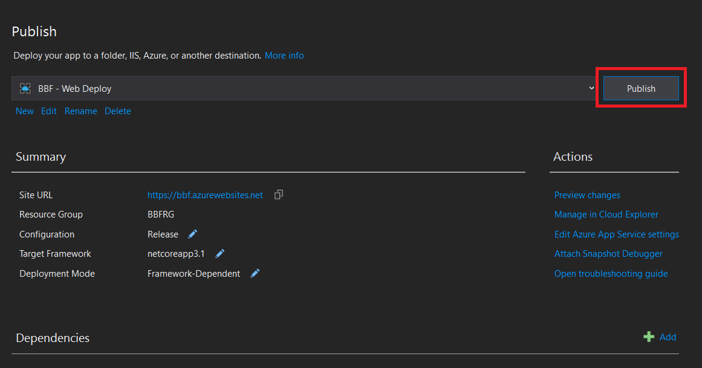
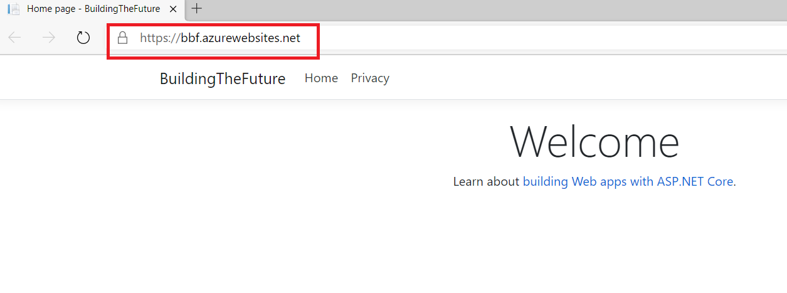
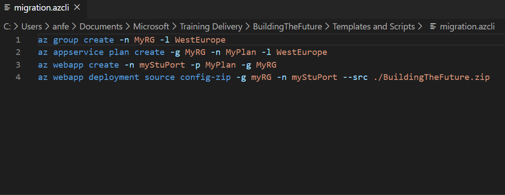
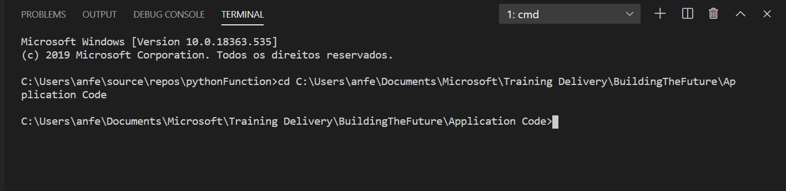
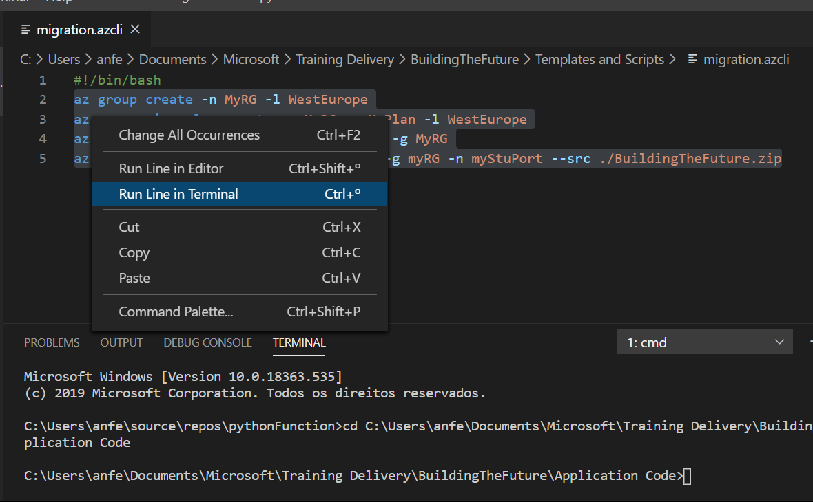

# Oprtion 1 - WebDeploy via Visual Studio
# Create a Publishing Profile
Right click the project name on Solution Explorer and click 'Publish':

Select 'Create New' and click 'Create Profile':

Choose an unique name for your App Service. Create a new Resource Group, a new App Service Plan (S1 tier, West Europe) and confgure a region for your App Insights container. Click 'Create':

New resources have been created in Azure. You can browse the Azure Portal to verify it.

# Publish to Azure 
Click on 'Publish':

Done! A new tab will open to show you your newly deployed application running in Azure and accessible on the Internet:

Next hands on Lab: [Autoscaling](https://github.com/andreatmicro/BuildingTheFuture/blob/master/3.%20Autoscaling/README.md)

# Option 2 - Azure CLI
# Download zipped application
Download zipped solution to your local environment from [here](https://github.com/andreatmicro/BuildingTheFuture/blob/master/1.%20.Net%20Core%20app%20running%20locally/BuildingTheFuture/BuildingTheFuture.zip)

# Adapt Azure CLI script
Downlaod the Azure CLI script in [here](https://github.com/andreatmicro/BuildingTheFuture/blob/master/2.%20Migration%20to%20Azure%20App%20Service/Templates%20and%20Scripts/migration.azcli) and open it in Visual Studio Code.
Change placeholders in script to personalized values.

# Change Working directory
Change working directory in Visual Studio Code's Terminal to the directory where the zip file is stored by running the command: 'cd path-to-directory'

# Run script
Highlight the commands in the script, right-click and select 'Run Line in Terminal'
 

Next hands on Lab: [Autoscaling](https://github.com/andreatmicro/BuildingTheFuture/blob/master/3.%20Autoscaling/README.md)

