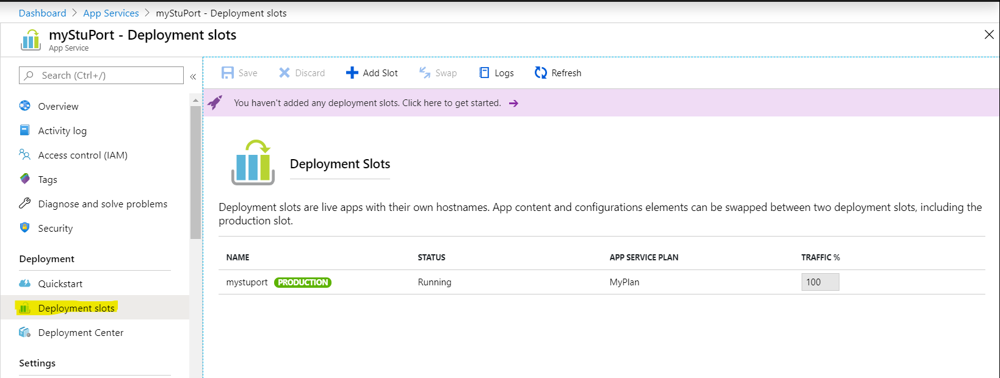
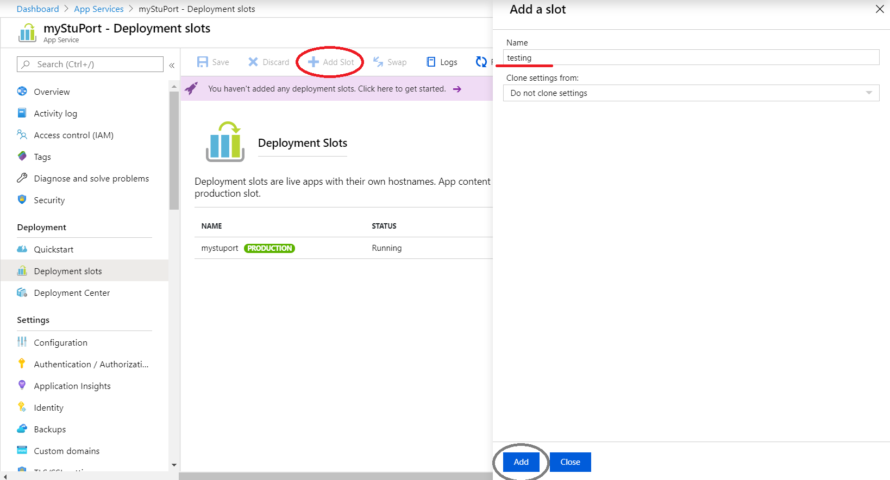
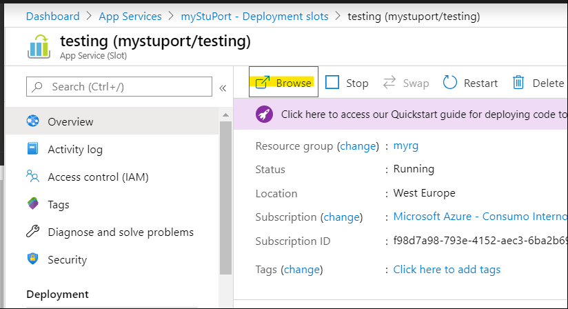
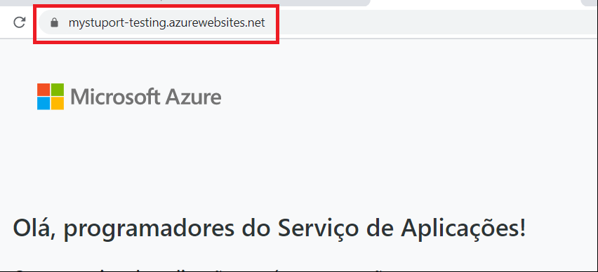
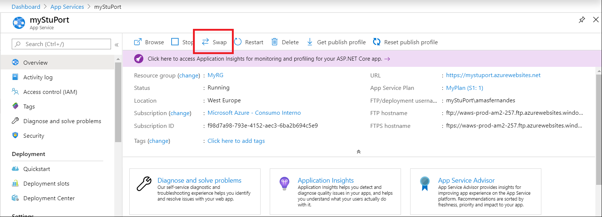
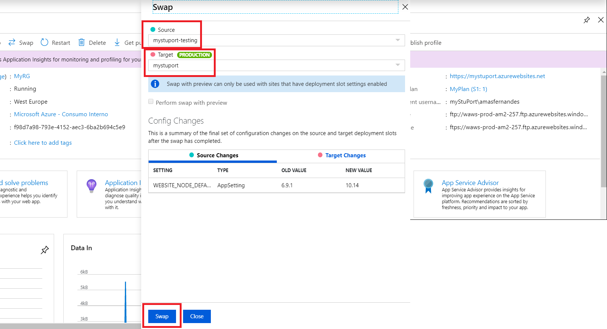
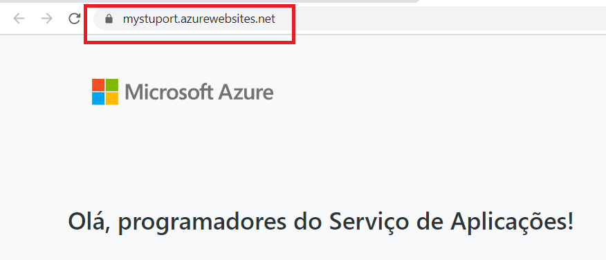
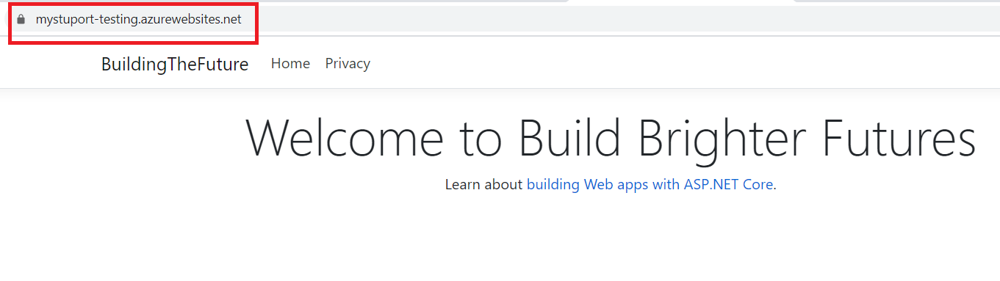
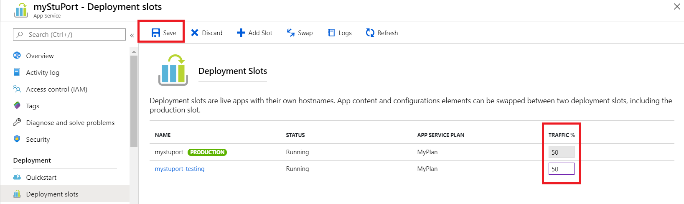
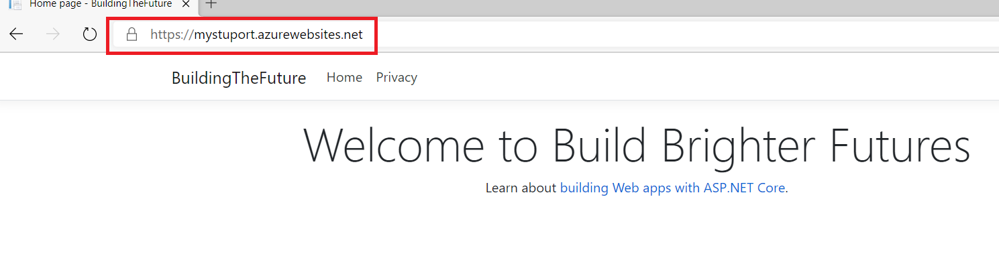

# Create a deployment slot

1. Browse to the 'Deployment Slots' blade:

2. Click on 'Add Slot'. Choose a slot name like "testing" or "staging", for example. Click the 'Add' button on the bottom of the page:

3. Once the slot is created, click on it and you will be redirected to the slot resource page. Once there, click on 'Browse':

4. Verify that the hostname used to access the slot is different (appname-slotname.azurewebsites.net) and that the site content is different:

# Swap slots

1. Open two tabs side by side. On one, browse to the production app, and on the other browse to the slot. Verify that content is correct in each one.

2. On another tab open the portal on your App Service resource page and click 'Swap':

3. Select the 'Source' of the Swap to be the slot you created, and the 'Target' the production app. Click 'Swap' on the bottom of the page:

4. Now that the Swap Operation is in place, go to the tab where you had your production app open. Do some requests to it and verify everything is still working normally. After a few requests (and a few seconds), you should see that the contents of your app has changed to the contents of the slot:

5. Now go to the tab where you have opened the slot. Refresh the page and verify that now the contents have changed to what was previously in production:

# Testing in Production

1. Go back to the 'Deployment Slots' blade. Change the routing property to 50% in the slot (the production traffic will adapt automatically). Click 'Save':

2. Open other browsers and browse to your production app. Check that your application shows different content in different browsers due to the Testing in Production feature:

Next hands on lab: [Azure DevOps](https://github.com/andreatmicro/BuildingTheFuture/tree/master/5.%20Azure%20DevOps)
