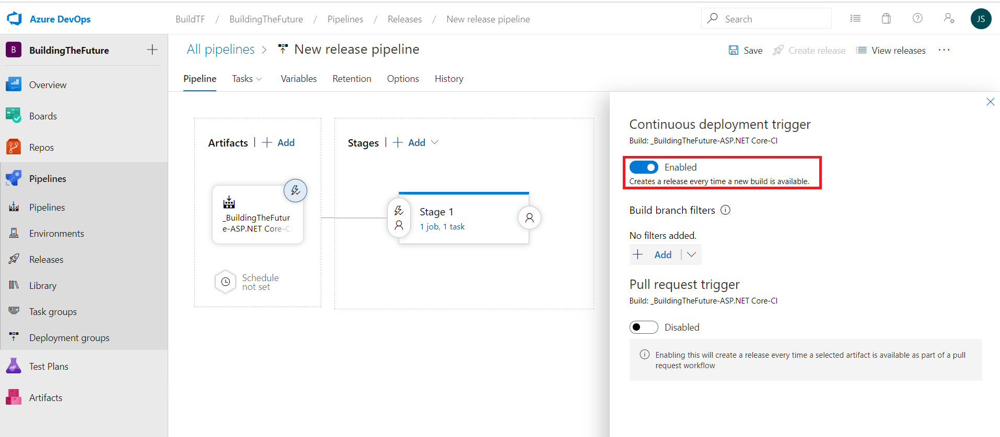

# Create an Azure DevOps project 

We will create a DevOps project to deploy our application. 
To create a DevOps project, you just need to go to https://azure.microsoft.com/services/devops/ click on start free and sign in with your account.

In your Azure DevOps account create a new team project BuildingTheFuture that uses Git for source control. 

In the new project, go to Repos and under the Files section you will see an option to clone or to push an existing repository from command line. The https git commands can be used to push our project to DevOps.

# Push WebApp content to Azure DevOps repo 

Open your application in Visual Studio and click on Add to Source Control, this will create a git repo in our project. 

Click on Publish Git Repo under Push to Azure DevOps Service, create a new project. This operation will push the content of our WebApp to our Azure DevOps Repo

On Visual studio on the changes pane in team explorer tab add a commit message and select commit all and push. 

Go to your Azure DevOps project repo and verify the files and the new commit in the commit pane

# Create a new Azure DevOps build pipeline

We have already configured the repo and pushed the WebApp content to our DevOps project. 
In this task we will create a build pipeline to build our project.

In Azure DevOps go to Pipelines and create a New pipeline, select use the classic editor 

As source select the Azure Repos Git and then select the BuildingTheFuture repository 

We will now choose a task that will build our ASP.NET Core Web Application, select the ASP.NET Core Task.

Let’s build our Web Application by clicking on Save & Queue and then on Save and Run, this will queue and start a build for our Web Application. Select the windows-2019 as the Agent. 

Confirm that the build succeeded

# Create a new Azure DevOps Release pipeline

We have already deployed our application to DevOps and built that application in the build pipeline, we will configure the release pipeline to deploy the application that we have built to Azure

In the pipelines select Release and create a New pipeline

Select the Azure App Service Deployment task 

Add an artifact to our release pipeline, this will refer the artifact that we have created in the build pipeline

Select 1 job 1 task to edit the created Azure App Service Deployment task

We must select now the subscription where the App Service is hosted and select that App Service in order to deploy our application

After confirming the name of the App Service, save the release pipeline and create a new release that will deploy our application to Azure

Confirm that the deployment succeeded

# Configure Continuous Integration and Continuous deployment and test End to End

We will now configure a continuous Integration and Continuous deployment(CICD) pipeline  
Go back to the build pipeline and click on Triggers and enable continuous integration, this will trigger a new build after each commit.

To Configure Continuous Deployment in Azure DevOps, go to the Release Pipeline and enable the Continuous Deployment Trigger 

To confirm that the Continuous Integration and Continuous Deployment (CICD) works correctly, change the code of the Web App, commit All and push.

We can see that the content deployed

Confirm that a new build and release as triggered and that the App service reflects the changes.
Confirm Continuous integration worked and that a new build started

Confirm Continuous deployment worked and that a new release started

Confirm that the content of our Web App changed according to the changes that we made

Next hands on lab: [Azure Serverless](https://github.com/andreatmicro/BuildingTheFuture/tree/master/6.%20Azure%20Serverless)

