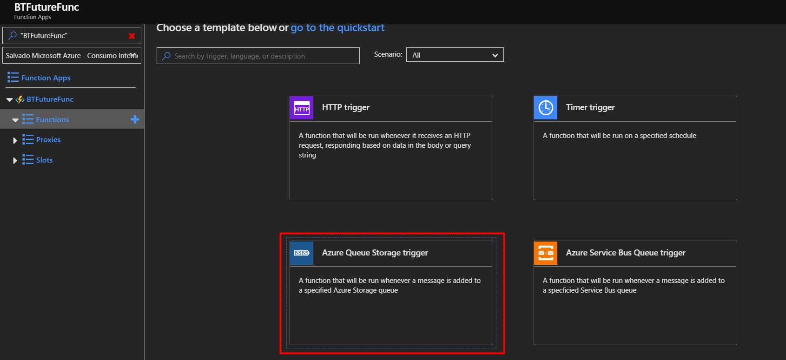
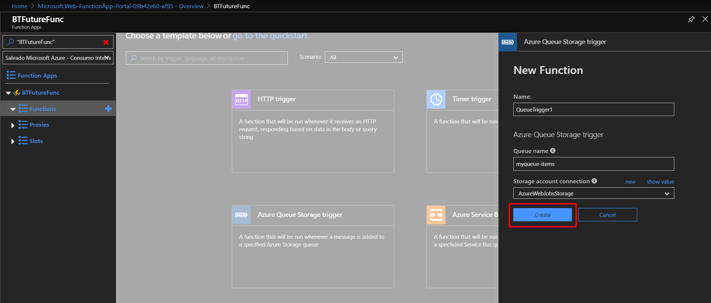

In this Lab we will show how you can implement a serverless Azure function to process Blob files in background.

Go to Azure portal and click on create a new resource, select Function App

Create a simple .NET Core function app, select the consumption plan as the hosting plan, save the name of the storage account as we will need in the future.

You have already created the function app, we will create now a function in our function app. Select "In-portal" option and then select "More templates".

There multiple templates that you can select for your first function, select the Azure Queue Storage trigger template.

Create the Queue trigger function.

You can check the logs of the function by clicking on the Logs blade.

It is time to add something to the queue and see our function gets trigger. 
In a different tab open Azure portal and go to storage accounts and select the storage account that we have created when we created the function.
In the storage explorer create a new queue with the name of the queue that we selected when we created the Queue trigger function myqueue-items

Add a simple message to the queue. 

Go back to your Azure Function and see in the logs the message that you have written.

